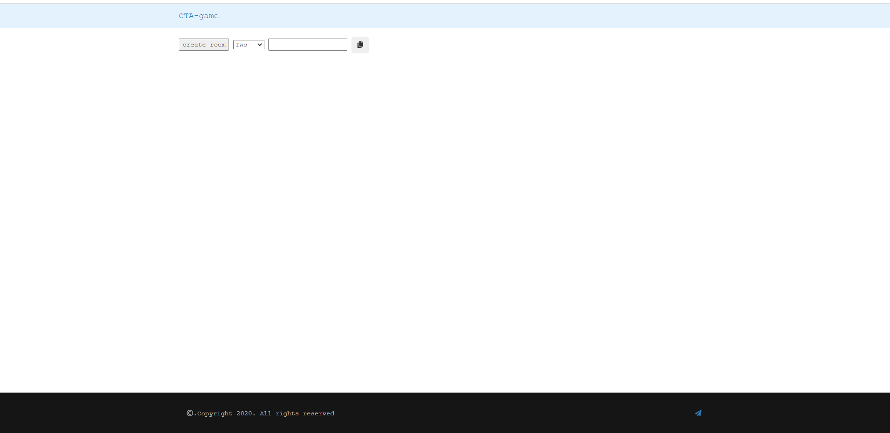

# 🎮 Capture The Area (CTA) Game

<div align="center">



**A real-time multiplayer competitive game where players race to capture numbered areas on a game board**

[](https://nodejs.org/)
[](https://socket.io/)
[](https://expressjs.com/)
[](LICENSE)

</div>

---

## 📋 Table of Contents

- [Overview](#overview)
- [Features](#features)
- [Tech Stack](#tech-stack)
- [Installation](#installation)
- [Usage](#usage)
- [Game Rules](#game-rules)
- [Security Features](#security-features)
- [Project Structure](#project-structure)
- [Contributing](#contributing)
- [License](#license)

---

## 🎯 Overview

**Capture The Area (CTA)** is an engaging real-time multiplayer browser game built with Node.js and Socket.IO. Players compete to claim the most numbered areas on a shared game board within a time limit. The game supports 2-4 players and features real-time synchronization, ensuring a smooth and competitive gameplay experience.

---

## ✨ Features

### Game Features
- 🎲 **Multiple Room Sizes**: Support for 2, 3, or 4 players per game
- ⏱️ **Timed Matches**: Games run for 30, 60, 90, or 120 seconds (randomly selected)
- 🎨 **Color-Coded Players**: Each player gets a unique color (Blue, Red, Yellow, Green)
- 🏆 **Real-time Scoring**: Live score updates and winner announcement
- 🗣️ **Voice Announcements**: Winner announced using Web Speech Synthesis API
- 📱 **Responsive Design**: Works on desktop and mobile devices
- 🔗 **Easy Room Sharing**: Copy room URL to invite friends

### Technical Features
- ⚡ **Real-time Communication**: Powered by Socket.IO for instant updates
- 🔒 **Security Hardened**: Input validation, XSS protection, rate limiting
- 🚀 **Performance Optimized**: Efficient broadcasting and memory management
- 🛡️ **Content Security Policy**: Enhanced security headers with Helmet.js
- 🧹 **Auto Cleanup**: Automatic room cleanup to prevent memory leaks
- 💾 **Cryptographically Secure**: Uses crypto module for secure ID generation

---

## 🛠️ Tech Stack

<div align="center">

| Category | Technologies |
|----------|-------------|
| **Backend** |  Node.js + Express.js |
| **Real-time** |  Socket.IO v2.3.0 |
| **Frontend** |  JavaScript + jQuery + Bootstrap 3 |
| **Templating** | EJS (Embedded JavaScript) |
| **Security** | Helmet.js + CORS + Input Sanitization |
| **Styling** |  CSS3 + Bootstrap |

</div>

---

## 📦 Installation

### Prerequisites
- Node.js (v12 or higher)
- npm (Node Package Manager)

### Steps

1. **Clone the repository**
   ```bash
   git clone https://github.com/avinashboy/CTA-games.git
   cd CTA-games
   ```

2. **Install dependencies**
   ```bash
   npm install
   ```

3. **Start the server**

   **Production mode:**
   ```bash
   npm start
   ```

   **Development mode (with auto-reload):**
   ```bash
   npm run dev
   ```

4. **Access the game**

   Open your browser and navigate to:
   ```
   http://localhost:2233
   ```

---

## 🎮 Usage

### Creating a Game Room

1. Open the application in your browser (`http://localhost:2233`)
2. Select the number of players (2, 3, or 4)
3. Click **"Create Room"**
4. Copy the generated room URL and share it with friends

### Joining a Game

1. Click the room URL shared by the host
2. Enter your name when prompted
3. Wait for all players to join
4. Game starts automatically when the room is full

### Playing the Game

1. Click on numbered areas to claim them (they'll turn your color)
2. Capture as many areas as possible before time runs out
3. The player with the most captured areas wins
4. Winner is announced with voice synthesis

---

## 📖 Game Rules

1. **Room Setup**: The host selects room size (2-4 players) and creates a room
2. **Joining**: Players join using the unique room URL
3. **Game Start**: Game begins when all slots are filled
4. **Gameplay**:
   - Each player is assigned a unique color
   - Click buttons to claim areas
   - Areas display the claiming player's name
   - Timer counts down from the preset time
5. **Winning**: Player with the most claimed areas wins
6. **Draw**: If multiple players have the same highest score, it's a draw

---

## 🔐 Security Features

The application includes comprehensive security measures:

### Input Validation
- ✅ All user inputs are validated and sanitized
- ✅ Maximum length restrictions on names and IDs
- ✅ HTML tag stripping to prevent injection attacks

### Rate Limiting
- ✅ Maximum 10 socket updates per second per client
- ✅ Prevents spam and DoS attacks

### XSS Protection
- ✅ All user-generated content sanitized before display
- ✅ Use of `textContent` instead of `innerHTML`
- ✅ Input encoding for URL parameters

### Security Headers
- ✅ Content Security Policy (CSP) via Helmet.js
- ✅ HSTS enabled for HTTPS connections
- ✅ X-Frame-Options to prevent clickjacking
- ✅ X-Content-Type-Options to prevent MIME sniffing

### Secure ID Generation
- ✅ Cryptographically secure random IDs using `crypto.randomBytes()`
- ✅ Unpredictable room and game identifiers

### Memory Protection
- ✅ Automatic room cleanup after 2 hours
- ✅ Game state cleanup 5 minutes after completion
- ✅ Rate limiting data cleaned on disconnect

---

## 📁 Project Structure

```
CTA-games/
├── game.js                 # Main server file (Express + Socket.IO)
├── package.json            # Node.js dependencies and scripts
├── Procfile               # Heroku deployment configuration
├── public/                # Static client-side files
│   ├── app.js            # Client-side game logic
│   └── check.js          # DevTools detection
├── views/                 # EJS templates
│   ├── index.ejs         # Home page / room creation
│   └── player.ejs        # Game board / player interface
├── cta-game.png          # Game screenshot
├── Readme.md             # This file
└── LICENSE               # License file
```

---

## 🚀 Deployment

### Heroku Deployment

This application is ready for Heroku deployment:

1. **Create a Heroku app**
   ```bash
   heroku create your-app-name
   ```

2. **Push to Heroku**
   ```bash
   git push heroku main
   ```

3. **Open the app**
   ```bash
   heroku open
   ```

The `Procfile` is already configured to run `node game.js`.

### Environment Variables

The app uses the following environment variable:
- `PORT`: Server port (default: 2233)

---

## 🔧 Configuration

### Game Settings

You can modify game parameters in `game.js`:

```javascript
const arr_timer = ['30', '60', '90', '120']  // Game duration options (seconds)
const arr_ball = ['16', '24', '32', '40']    // Number of areas options
const roomSize = { 2: '1', 3: '2', 4: '3' }  // Room size mapping
```

### Rate Limiting

Adjust rate limiting in `game.js`:

```javascript
const RATE_LIMIT_WINDOW = 1000         // Time window in milliseconds
const MAX_UPDATES_PER_WINDOW = 10      // Max updates per window
```

---

## 🤝 Contributing

Contributions are welcome! Here's how you can help:

1. **Fork the repository**
2. **Create a feature branch**
   ```bash
   git checkout -b feature/amazing-feature
   ```
3. **Commit your changes**
   ```bash
   git commit -m 'Add amazing feature'
   ```
4. **Push to the branch**
   ```bash
   git push origin feature/amazing-feature
   ```
5. **Open a Pull Request**

### Development Guidelines

- Follow existing code style and conventions
- Add comments for complex logic
- Test your changes thoroughly
- Update documentation as needed
- Ensure security best practices

---

## 🐛 Known Issues

- Game requires stable internet connection for real-time sync
- Browser must support Web Speech Synthesis API for voice announcements
- DevTools detection (`check.js`) can be bypassed by advanced users

---

## 📝 Version History

### v2.0.0 (Latest)
- ✅ Fixed critical security vulnerabilities (XSS, injection attacks)
- ✅ Implemented rate limiting to prevent spam
- ✅ Added cryptographically secure ID generation
- ✅ Fixed memory leaks with automatic cleanup
- ✅ Optimized performance (90% reduction in broadcasts)
- ✅ Fixed hardcoded URLs for production deployment
- ✅ Enhanced error handling throughout
- ✅ Added Content Security Policy headers
- ✅ Improved winner calculation algorithm
- ✅ Added click debouncing

### v1.0.0
- Initial release with basic gameplay

---

## 📄 License

This project is licensed under the ISC License. See the [LICENSE](LICENSE) file for details.

---

## 👤 Author

**Avinash**

- GitHub: [@avinashboy](https://github.com/avinashboy)

---

## 🙏 Acknowledgments

- Socket.IO team for the amazing real-time engine
- Express.js community for the robust web framework
- Bootstrap for the responsive UI components
- All contributors and players who provided feedback

---

## 📧 Support

For bugs, questions, or suggestions:
- Open an issue on [GitHub](https://github.com/avinashboy/CTA-games/issues)
- Submit feedback via the [feedback form](https://forms.gle/U8vBmWHDaDb9Y9859)

---

<div align="center">

**Made with ❤️ and Node.js**

⭐ Star this repo if you find it helpful!

</div>
